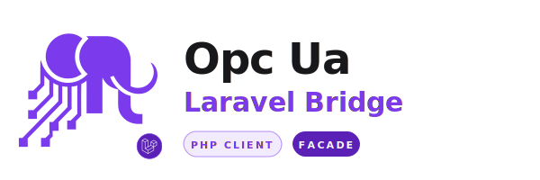

<h1 align="center"><strong>OPC UA Laravel Client</strong></h1>

<div align="center">
  <picture>
    <source media="(prefers-color-scheme: dark)" srcset="assets/logo-dark.svg">
    <source media="(prefers-color-scheme: light)" srcset="assets/logo-light.svg">
    
  </picture>
</div>

<p align="center">
  <a href="https://github.com/GianfriAur/opcua-laravel-client/actions/workflows/tests.yml"></a>
  <a href="https://codecov.io/gh/GianfriAur/opcua-laravel-client"></a>
  <a href="https://packagist.org/packages/gianfriaur/opcua-laravel-client"></a>
  <a href="https://packagist.org/packages/gianfriaur/opcua-laravel-client"></a>
  <a href="LICENSE"></a>
</p>

---

Laravel integration for [OPC UA](https://opcfoundation.org/about/opc-technologies/opc-ua/) built on [`opcua-php-client`](https://github.com/GianfriAur/opcua-php-client) and [`opcua-php-client-session-manager`](https://github.com/GianfriAur/opcua-php-client-session-manager). Connect your Laravel app to PLCs, SCADA systems, sensors, and IoT devices with a familiar developer experience: a `Facade`, `.env`-based configuration, named connections (like `config/database.php`), and an Artisan command for the optional session manager daemon.

**What you get:**

- **Facade** — `Opcua::read('i=2259')` with full IDE autocompletion
- **Named connections** — define multiple OPC UA servers and switch between them, just like database connections
- **Transparent session management** — when the daemon is running, connections persist across HTTP requests; when it's not, direct per-request connections with zero code changes
- **Laravel-native logging and caching** — your log channel and cache store are automatically injected into every OPC UA client
- **All OPC UA operations** — browse, read, write, method calls, subscriptions, events, history, path resolution, type discovery

> **Note:** This package wraps the full [opcua-php-client](https://github.com/GianfriAur/opcua-php-client) API with Laravel conventions. For the underlying protocol details, types, and advanced features, see the [client documentation](https://github.com/GianfriAur/opcua-php-client/tree/master/doc).

## Quick Start

```bash
composer require gianfriaur/opcua-laravel-client
```

```dotenv
OPCUA_ENDPOINT=opc.tcp://192.168.1.100:4840
```

```php
use Gianfriaur\OpcuaLaravel\Facades\Opcua;

$client = Opcua::connect();

$value = $client->read('i=2259');
echo $value->getValue(); // 0 = Running

$client->disconnect();
```

That's it. Facade, `.env`, connect, read. Everything else is optional.

## See It in Action

### Browse the address space

```php
$client = Opcua::connect();

$refs = $client->browse('i=85'); // Objects folder
foreach ($refs as $ref) {
    echo "{$ref->displayName} ({$ref->nodeId})\n";
}

$client->disconnect();
```

### Read multiple values with fluent builder

```php
$client = Opcua::connect();

$results = $client->readMulti()
    ->node('i=2259')->value()
    ->node('ns=2;i=1001')->displayName()
    ->execute();

foreach ($results as $dv) {
    echo $dv->getValue() . "\n";
}

$client->disconnect();
```

### Write to a PLC

```php
use Gianfriaur\OpcuaPhpClient\Types\BuiltinType;

$client = Opcua::connect();
$client->write('ns=2;i=1001', 42, BuiltinType::Int32);
$client->disconnect();
```

### Call a method on the server

```php
use Gianfriaur\OpcuaPhpClient\Types\Variant;
use Gianfriaur\OpcuaPhpClient\Types\BuiltinType;

$client = Opcua::connect();

$result = $client->call(
    'i=2253',   // Server object
    'i=11492',  // Method
    [new Variant(BuiltinType::UInt32, 1)],
);

echo $result->statusCode;               // 0
echo $result->outputArguments[0]->value; // [1001, 1002, ...]

$client->disconnect();
```

### Subscribe to data changes

```php
$client = Opcua::connect();

$sub = $client->createSubscription(publishingInterval: 500.0);
$client->createMonitoredItems($sub->subscriptionId, [
    ['nodeId' => 'ns=2;i=1001'],
]);

$response = $client->publish();
foreach ($response->notifications as $notif) {
    echo $notif['dataValue']->getValue() . "\n";
}

$client->deleteSubscription($sub->subscriptionId);
$client->disconnect();
```

### Switch connections

```php
// Named connection from config
$client = Opcua::connect('plc-line-1');
$value = $client->read('ns=2;i=1001');
Opcua::disconnect('plc-line-1');

// Ad-hoc connection at runtime
$client = Opcua::connectTo('opc.tcp://10.0.0.50:4840', [
    'username' => 'operator',
    'password' => 'secret',
], as: 'temp-plc');

Opcua::disconnectAll();
```

### Test without a real server

```php
use Gianfriaur\OpcuaPhpClient\Testing\MockClient;
use Gianfriaur\OpcuaPhpClient\Types\DataValue;

$mock = MockClient::create()
    ->onRead('i=2259', fn() => DataValue::ofInt32(0));

// Inject into OpcuaManager via DI or reflection
$value = $mock->read('i=2259');
echo $value->getValue(); // 0
echo $mock->callCount('read'); // 1
```

## Features

| Feature | What it does |
|---|---|
| **Facade** | `Opcua::read()`, `Opcua::browse()`, etc. with full PHPDoc for IDE autocompletion |
| **Named Connections** | Define multiple servers in `config/opcua.php`, switch with `Opcua::connection('plc-2')` |
| **Ad-hoc Connections** | `Opcua::connectTo('opc.tcp://...')` for endpoints not in config |
| **Session Manager** | Artisan command `php artisan opcua:session` for daemon-based session persistence |
| **Transparent Fallback** | Daemon available? ManagedClient. Not available? Direct Client. Zero code changes |
| **String NodeIds** | `'i=2259'`, `'ns=2;s=MyNode'` everywhere a `NodeId` is accepted |
| **Fluent Builder API** | `readMulti()`, `writeMulti()`, `createMonitoredItems()`, `translateBrowsePaths()` chain |
| **PSR-3 Logging** | Laravel's log channel injected automatically. Override with `setLogger()` |
| **PSR-16 Caching** | Laravel's cache store injected automatically. Per-call `useCache` on browse ops |
| **Type Discovery** | `discoverDataTypes()` auto-detects custom server structures |
| **Subscription Transfer** | `transferSubscriptions()` and `republish()` for session recovery |
| **MockClient** | Test without a server — register handlers, assert calls |
| **Timeout & Retry** | Per-connection `timeout`, `auto_retry` via config or fluent API |
| **Auto-Batching** | `readMulti`/`writeMulti` transparently split when exceeding server limits |
| **Recursive Browse** | `browseAll()`, `browseRecursive()` with depth control and cycle detection |
| **Path Resolution** | `resolveNodeId('/Objects/Server/ServerStatus')` |
| **Security** | 6 policies, 3 auth modes, auto-generated certs |
| **History Read** | Raw, processed, and at-time historical queries |
| **Typed Returns** | All service responses return `public readonly` DTOs |

## Documentation

| # | Document | Covers |
|---|----------|--------|
| 01 | [Introduction](doc/01-introduction.md) | Overview, requirements, architecture, quick start |
| 02 | [Installation & Configuration](doc/02-installation.md) | Composer, config file, `.env`, connections, session manager |
| 03 | [Usage](doc/03-usage.md) | Reading, writing, browsing, methods, subscriptions, history |
| 04 | [Connections](doc/04-connections.md) | Named, ad-hoc, switching, disconnect, dependency injection |
| 05 | [Session Manager](doc/05-session-manager.md) | Daemon, Artisan command, Supervisor, architecture |
| 06 | [Logging & Caching](doc/06-logging-caching.md) | PSR-3/PSR-16, Laravel integration, per-call cache control |
| 07 | [Security](doc/07-security.md) | Policies, modes, certificates, authentication |
| 08 | [Testing](doc/08-testing.md) | MockClient, DataValue factories, unit and integration tests |
| 09 | [Examples](doc/09-examples.md) | Complete code examples for all features |

## Testing

66+ unit tests with **99%+ code coverage**. Integration tests run against [opcua-test-server-suite](https://github.com/GianfriAur/opcua-test-server-suite) Docker containers in both direct and managed (daemon) modes.

```bash
./vendor/bin/pest tests/Unit/                              # unit only
./vendor/bin/pest tests/Integration/ --group=integration   # integration only
./vendor/bin/pest                                          # everything
```

## Ecosystem

| Package | Description |
|---------|-------------|
| [opcua-php-client](https://github.com/GianfriAur/opcua-php-client) | Pure PHP OPC UA client — the core protocol implementation |
| [opcua-php-client-session-manager](https://github.com/GianfriAur/opcua-php-client-session-manager) | Daemon-based session persistence across PHP requests |
| [opcua-laravel-client](https://github.com/GianfriAur/opcua-laravel-client) | Laravel integration (this package) |
| [opcua-test-server-suite](https://github.com/GianfriAur/opcua-test-server-suite) | Docker-based OPC UA test servers for integration testing |

## Contributing

Contributions welcome — see [CONTRIBUTING.md](CONTRIBUTING.md).

## Changelog

See [CHANGELOG.md](CHANGELOG.md).

## License

[MIT](LICENSE)
